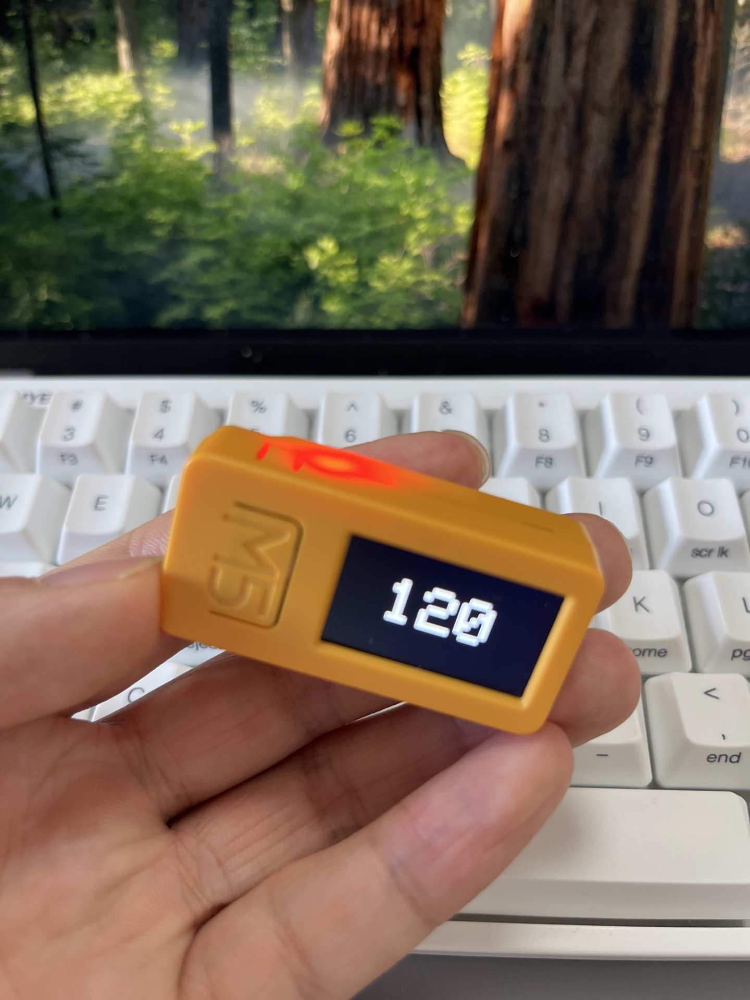
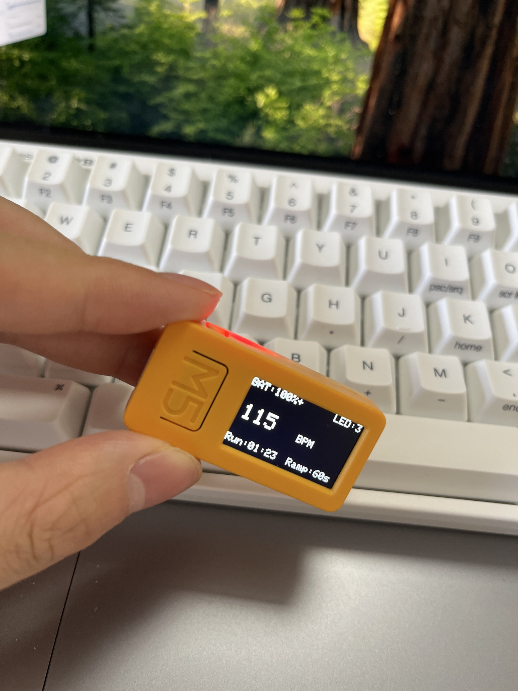

# ADHD Focus Light

[中文版](README_CN.md)

Un parpadeador LED rojo con ritmo de latido para M5StickC Plus2 diseñado para ayudar a personas con TDAH a mejorar la concentración y el enfoque.

## Antecedentes

Este proyecto se inspira en un [comentario de Hacker News](https://news.ycombinator.com/item?id=38274782) donde un usuario compartió su truco personal para gestionar el TDAH:

> Coloca un pequeño LED al lado de tu monitor. Haz que parpadee como un latido rápido (120-150 bpm) y poco a poco se desacelere hasta alrededor de 60 bpm. Sin darte cuenta, tu cerebro intentará sincronizarse con la luz que apenas ves, relajándote y permitiéndote concentrarte. ¡Funciona como hipnosis!

Este proyecto también se basa en [ADHD_Blink](https://github.com/Qiaogun/ADHD_Blink) de Qiaogun, que implementó este concepto para M5StickC Plus. Esta versión está actualizada para el hardware más reciente M5StickC Plus2.

## Fotos

| Modo Minimalista | Modo Información |
|:----------------:|:----------------:|
|  |  |

## Características

- **Parpadeo con 50% de ciclo de trabajo**: Patrón de parpadeo natural (mitad encendido, mitad apagado por cada latido)
- **Múltiples modos BPM**: 120 → 100 → 80 → 60 → PAUSA
- **Descenso de ritmo configurable**: El BPM disminuye en 5 en intervalos configurables (30s/60s/90s/2m/OFF)
- **Flujo de suspensión automática**: 60 BPM durante 5 min → PAUSA durante 2 min → Apagado automático
- **Brillo del LED ajustable**: 4 niveles (30/80/150/255), nivel predeterminado 3
- **Brillo de pantalla ajustable**: 4 niveles (20/60/120/200), nivel predeterminado 3
- **Modos de visualización dual**: Modo minimalista (solo BPM) y modo información
- **Alimentado con batería**: Diseño portátil usando la batería integrada de M5StickC Plus2

## Requisitos de Hardware

- [M5StickC Plus2](https://shop.m5stack.com/products/m5stickc-plus2-esp32-mini-iot-development-kit) (kit de desarrollo mini basado en ESP32)

## Instalación

### Requisitos previos

1. Instalar [Arduino IDE](https://www.arduino.cc/en/software) o [arduino-cli](https://arduino.github.io/arduino-cli/)
2. Agregar URL del gestor de placas de M5Stack:
   ```
   https://static-cdn.m5stack.com/resource/arduino/package_m5stack_index.json
   ```
3. Instalar el paquete de placas M5Stack ESP32
4. Instalar la biblioteca `M5StickCPlus2`

### Usando Arduino CLI

```bash
# Agregar URL de la placa M5Stack
arduino-cli config add board_manager.additional_urls https://static-cdn.m5stack.com/resource/arduino/package_m5stack_index.json

# Actualizar índice e instalar placa
arduino-cli core update-index
arduino-cli core install m5stack:esp32

# Compilar
arduino-cli compile --fqbn m5stack:esp32:m5stack_stickc_plus2 adhd.ino

# Subir (reemplazar PORT con tu puerto serial)
arduino-cli upload -p PORT --fqbn m5stack:esp32:m5stack_stickc_plus2 adhd.ino
```

### Usando Arduino IDE

1. Abrir `adhd.ino` en Arduino IDE
2. Seleccionar Placa: `M5StickC Plus2`
3. Seleccionar el Puerto correcto
4. Hacer clic en Subir

## Uso

### Controles de Botones

#### Modo Minimalista (Página 0) - Predeterminado
| Botón | Pulsación corta | Pulsación larga |
|-------|-----------------|-----------------|
| **BtnA** (frontal) | Cambiar modos: 120 → 100 → 80 → 60 → PAUSA → 120... | - |
| **BtnB** (lateral) | Cambiar a Modo Información | Cambiar brillo de pantalla |

#### Modo Información (Página 1)
| Botón | Pulsación corta | Pulsación larga |
|-------|-----------------|-----------------|
| **BtnA** (frontal) | Cambiar brillo del LED (1→2→3→4) | Cambiar intervalo de descenso |
| **BtnB** (lateral) | Cambiar a Modo Minimalista | Cambiar brillo de pantalla |

### Modos de Visualización

- **Modo Minimalista**: Número grande centrado de BPM o "PAUSA" - cero distracciones
- **Modo Información**: Muestra % de batería, brillo del LED, BPM/PAUSA, tiempo de ejecución y configuración de descenso
  - Barra superior: `BAT:XX%[+]` (izquierda) y `LED:X` (derecha)
  - Centro: Valor grande de BPM o "PAUSA"
  - Barra inferior: `Run:MM:SS` (izquierda) y `Ramp:XXs` (derecha)
  - El LED permanece encendido constantemente para ayudar a ajustar el brillo
  - La visualización es estática (instantánea del tiempo al entrar) para ahorrar energía

### Intervalos de Descenso

Configurables mediante pulsación larga en BtnA en Modo Información:
- **30s**: Descenso rápido
- **60s**: Predeterminado
- **90s**: Descenso lento
- **2m**: Descenso muy lento
- **OFF**: Sin descenso automático

### Flujo de Suspensión Automática

```
120 BPM → 100 → 80 → 60 → [5 min] → PAUSA → [2 min] → Apagado
```

1. El BPM disminuye en 5 en cada intervalo de descenso
2. Después de alcanzar 60 BPM, continúa durante 5 minutos
3. Ingresa automáticamente en modo PAUSA
4. Después de 2 minutos en PAUSA, el dispositivo se apaga

Cambiar manualmente los modos restablece todos los temporizadores.

## Cómo Funciona

1. **Inicio**: El LED rojo se enciende durante 2 segundos como prueba de funcionamiento
2. **Funcionamiento**: El LED parpadea con un ciclo de trabajo del 50% a la frecuencia actual de BPM
3. **Descenso automático**: El BPM disminuye en 5 en el intervalo configurado (mínimo 60 BPM)
4. **Suspensión automática**: Después de alcanzar 60 BPM durante 5 minutos, se pausa y luego se apaga

## Configuración Predeterminada

| Configuración | Valor Predeterminado |
|---------------|----------------------|
| BPM inicial | 120 |
| Brillo del LED | Nivel 3 (150/255) |
| Brillo de pantalla | Nivel 3 (120/200) |
| Intervalo de descenso | 60 segundos |
| Modo de visualización | Minimalista |

## Historial de Estrellas

[](https://star-history.com/#zonghaoyuan/adhd-focus-light&Date)

## Licencia

Licencia MIT - Siéntete libre de usar, modificar y distribuir.

## Contribuir

¡Las contribuciones son bienvenidas! Siéntete libre de enviar problemas o solicitudes de extracción.

## Agradecimientos

- Idea original de [este comentario de Hacker News](https://news.ycombinator.com/item?id=38274782)
- Basado en [ADHD_Blink](https://github.com/Qiaogun/ADHD_Blink) de Qiaogun
- Construido con [Biblioteca M5StickCPlus2](https://github.com/m5stack/M5StickCPlus2)
